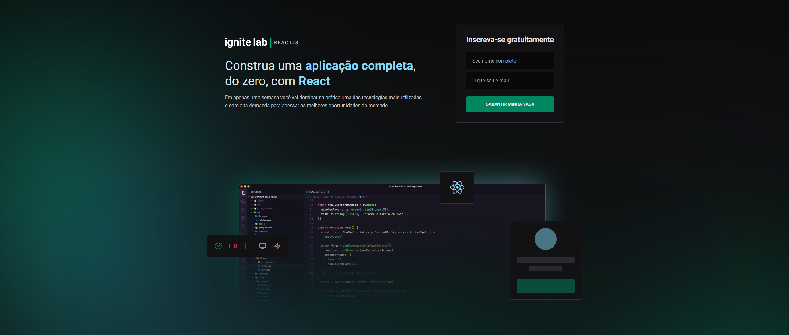
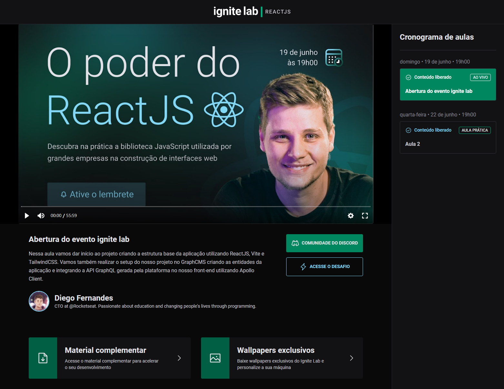

# Ignite-Lab

## Tecnologias utilizadas:
<ul>
  <li>Vite</li>
  <li>GraphQL</li>
  <li>GraphQL Code Generator</li>
  <li>Tailwind</li>
  <li>Vime (Video lib)</li>
</ul>

# Subscribe Page

    

# Event Page

    

